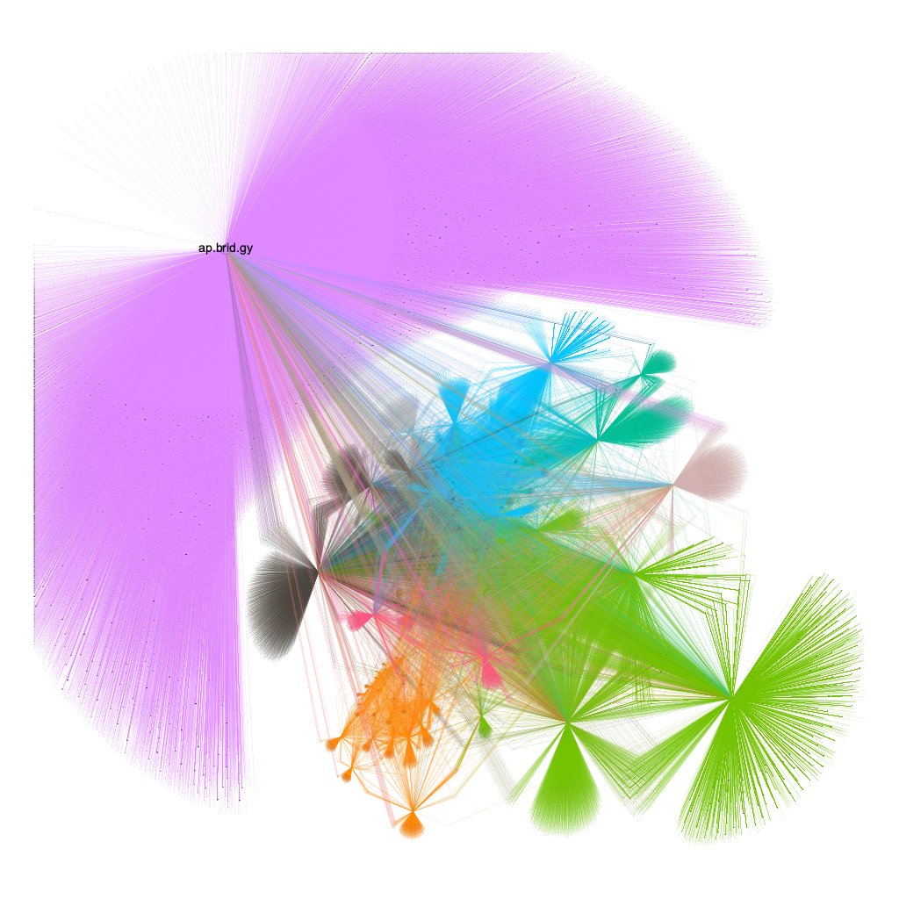

# BlueSky Follows Scrapper

This tool was developed with the aim of recovering all the connections between users, so that this graph could then be mapped on Gephi.
I'm currently struggling with my machine's lack of power to process the entire graph.
I've managed to display a graph consisting of 70,000 nodes, here's the result.

The program return 2 files in the data directory: nodes.csv and edges.csv



## Setup
```bash
pnpm install
```
## Usage

```bash
pnpm run start "<blueSkyUsername>" "<limitUser>"
```

blueSkyUsername` is the `handle` field returned by the api. Example: `elouanreymond.com`

By default, `limitUser` is set to -1, which means there is no limit. But you can specify a number to limit the number of users you want to process.
> [!NOTE]  
> If you specify 10 for `limitUser` then the program will process all follow-ups from these 10 users. This means that the nodes.csv file will contain the ten processed users **but also** all their followers.

### Example 

To process 10 users
```bash
pnpm run start elouanreymond.com 10 
```